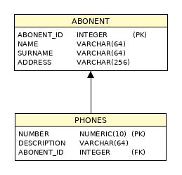
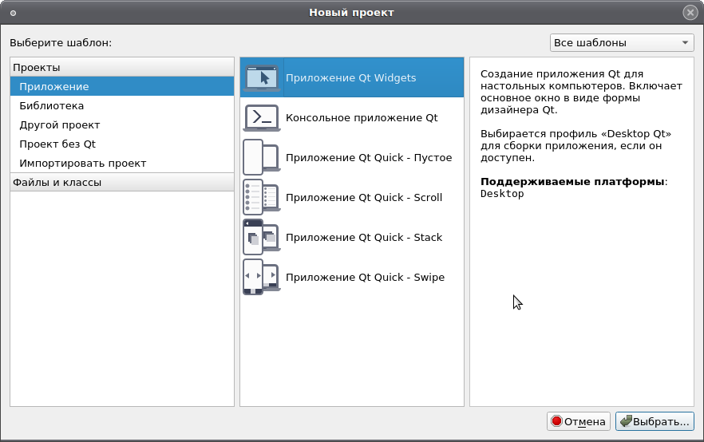
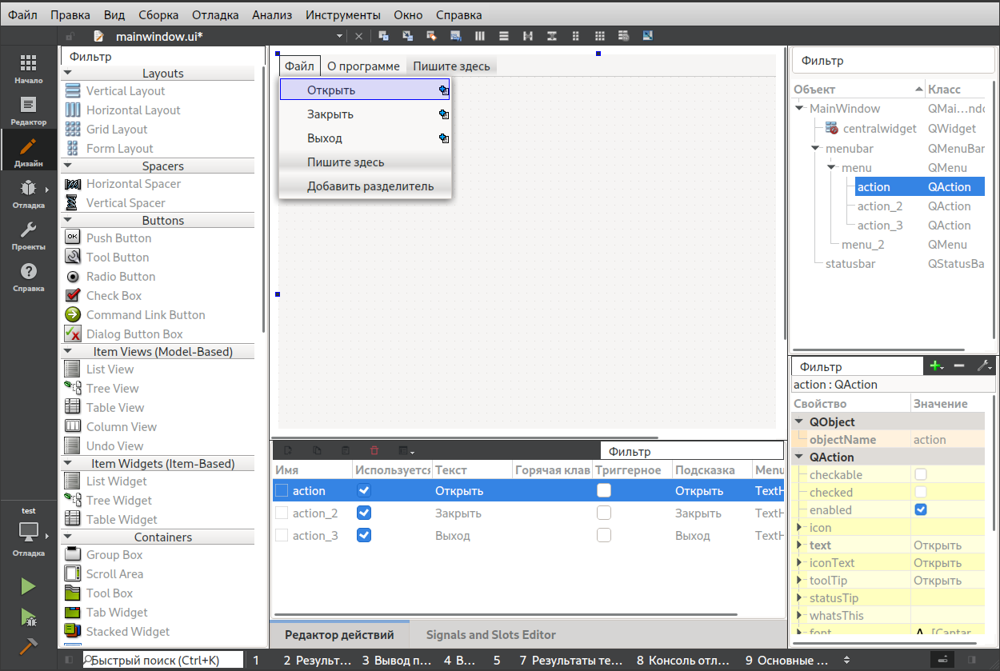
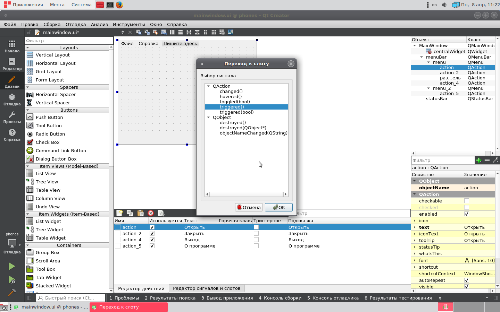

В данной лабораторной работе рассматривается пример создания простейшего
приложения в среде QtCreator, работающего с БД.

# Структура БД

Для разработки приложения необходимо создать БД следующей структуры:



# Создание проекта и интерфейса

Создаем новый проект


В качестве шаблона выбираем "Приложение/Приложение Qt Widgets"



Далее выбираем все опции по умолчанию, указав имя проекта (`phones`) и
его расположение. В дереве объектов дважды кликаем по форме
(`mainwindow.ui`) и приступаем к размещению элементов на форме. Для
этого используются `Push Button`, меню и `QTreeView`. В меню создаем ряд
пунктов для открытия, закрытия БД, выхода и показа справки.



Остальные компоненты размещаем как на рисунке. Первой кнопке
устанавливаем свойства: objectName = \"btnAdd\" text = \"Добавить\"
Свойство text можно выставить двойным кликом по компоненту.

Аналогичным образом выставляем свойства оставшихся кнопок, так что в
итоге должно получиться (слева направо):

> 1.  btnAdd, \"Добавить\"
> 2.  btnDel, \"Удалить\"
> 3.  btnSave, \"Сохранить\"
> 4.  btnCancel, \"Отменить\"
> 5.  btnRefresh, \"Обновить\"

Чтобы выровнять их необходимо все выделить и скомпоновать по горизонтали
(ПКМ (правая кнопка мыши), Компоновка, По горизонтали).

Далее перетаскиваем компонент `Tree View` и чтобы все выровнять, ПКМ по
свободному месту на форме, Компоновка, По вертикали. Меняем у компонента
свойство objectName=\"abonentView\". У нас получится форма, как на
рисунке, с выровненными компонентами, способными адаптироваться под
изменения размеров окна. Подробнее о компоновке изучите отдельно.


# Написание кода

Перед написанием добавим в файл проекта `CMakeLists.txt` компонент Sql и
дописать в компоненты, линкуемые к приложению `phones`.

``` 
find_package(Qt${QT_VERSION_MAJOR} REQUIRED COMPONENTS Widgets Sql)
...
target_link_libraries(phones PRIVATE Qt${QT_VERSION_MAJOR}::Widgets Qt${QT_VERSION_MAJOR}::Sql)
```

Перед добавлением кода обработчиков, добавить нужные заголовочные файлы
для работы с базами данных и объявить поле для модели данных. Это
делается в классе `MainWindow` файла `mainwindow.h` следующим образом:

``` c++
#include <QMainWindow>
#include <QtSql/QSqlQuery>
#include <QtSql/QSqlTableModel>

namespace Ui {
class MainWindow;
}

// ранее сгенерированный код

private:
    Ui::MainWindow *ui;

    QSqlTableModel *abonentModel = nullptr;
};
```

Также добавим заголовочные файлы, которые нам понадобятся в файле
`mainwindow.cpp`:

``` c++
#include "mainwindow.h"
#include "ui_mainwindow.h"

// новые файлы
#include <QMessageBox>
#include <QtSql/QSqlDatabase>
#include <QtSql/QSqlError>
#include <QFileDialog>
#include <QDebug>
```

Обработчик нажатия пунктов меню пишется следующим образом:

1.  Выделяем нужный пункт меню на форме.
2.  Внизу также будет список пунктов. На нужном кликаем правой кнопкой
    мыши и выбираем "Переход к слоту". Далее выбираем "triggered".
3.  Открывается редактор кода, в котором мы увидим заготовку метода,
    который будет вызван при нажатии на пункт меню.



Добавляем код соединения с БД, т.е. обработчик пункта меню
"Файл/Открыть"

``` c++
// Connection is already open
if (abonentModel)  // Field of MainWindow
    return;

QSqlDatabase db = QSqlDatabase::addDatabase("QIBASE", "phones");
db.setHostName("localhost");
db.setDatabaseName(QFileDialog::getOpenFileName(this, "Open Database", "/var/rdb", "Database files (*.fdb);;All files (*)"));
 
const bool ok = db.open("SYSDBA", "masterkey");
 
if (!ok)
{
    ShowMessage("Ошибка подключения");
    return;
}

abonentModel = new QSqlTableModel(this, db);
abonentModel->setTable("ABONENT");
abonentModel->setEditStrategy(QSqlTableModel::OnManualSubmit);
abonentModel->select();
ui->abonentView->setModel(abonentModel);
```

Код для закрытия БД

``` c++
delete abonentModel;
abonentModel = nullptr;
QSqlDatabase::database("phones").close();
```

Можно протестировать. БД должна открываться и данные должны появляться в
таблице. Функции `ShowMessage` нужна для вывода сообщений на экран. Она
определяется в начале файла `mainwindow.cpp` следующим образом.

``` c++
void ShowMessage(const QString text)
{
    QMessageBox msg;
    msg.setText(text);
    msg.exec();
}
```

Для написания обработчика нажатия кнопки кликните на ней на форме правой
кнопкой мыши и в "Перейти к слоту" выберете `сlicked`. Ниже все
обработчики кнопок. Говорящие названия обработчиков описывают действия.

``` c++
void MainWindow::on_btnAdd_clicked()
{
    if (!abonentModel->insertRow(0))
        ShowMessage(abonentModel->lastError().text());
}

void MainWindow::on_btnSave_clicked()
{
    if (!abonentModel->submitAll())
        ShowMessage(abonentModel->lastError().text());
}

void MainWindow::on_btnDel_clicked()
{
    QModelIndex i = ui->abonentView->selectionModel()->currentIndex();
    if (!abonentModel->removeRow(i.row()))
        ShowMessage(abonentModel->lastError().text());
}

void MainWindow::on_btnCancel_clicked()
{
    abonentModel->revertAll();
}

void MainWindow::on_btnRefresh_clicked()
{
    abonentModel->select();
}
```

::: important
::: title
Important
:::

На этом разработка первого приложения завершена. Необходимо его
тщательно протестировать.
:::
