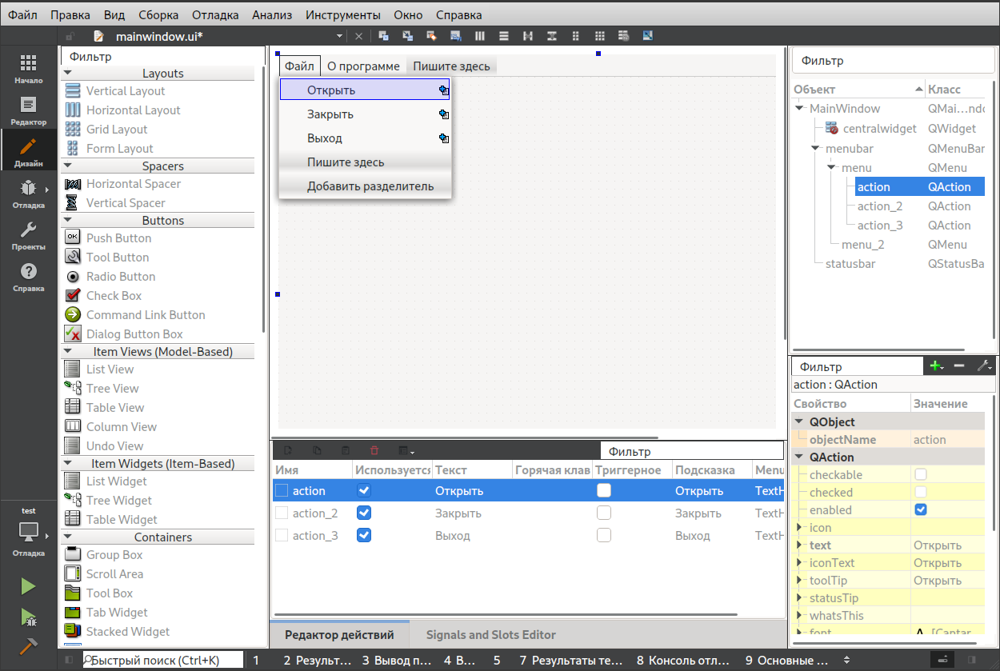
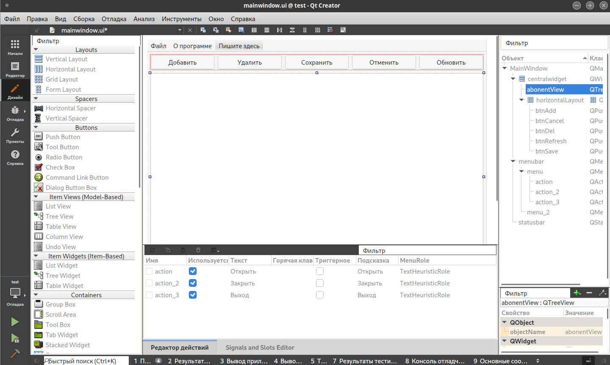

.. _qt-tutorial:

***************************
Разработка приложения на Qt
***************************

В данной лабораторной работе рассматривается пример создания простейшего приложения в среде QtCreator, работающего с БД.

Структура БД
============

Для разработки приложения необходимо создать БД следующей структуры:

.. image:: img/qt/db.jpeg

Создание проекта и интерфейса
=============================

Создаем новый проект

.. image:: img/qt/new_project.png

В качестве шаблона выбираем “Приложение/Приложение Qt Widgets”

.. image:: img/qt/project_type.png

Далее выбираем все опции по умолчанию, указав имя проекта (``phones``) и его расположение.
В дереве объектов дважды кликаем по форме (``mainwindow.ui``) и приступаем к размещению элементов на форме. Для этого используются ``Push Button``, меню и ``QTreeView``.
В меню создаем ряд пунктов для открытия, закрытия БД, выхода и показа справки.

Остальные компоненты размещаем как на рисунке.
Первой кнопке устанавливаем свойства:
objectName = "btnAdd"
text = "Добавить"
Свойство text можно выставить двойным кликом по компоненту.

Аналогичным образом выставляем свойства оставшихся кнопок, так что в итоге должно получиться (слева направо):

    1. btnAdd, "Добавить"
    2. btnDel, "Удалить"
    3. btnSave, "Сохранить"
    4. btnCancel, "Отменить"
    5. btnRefresh, "Обновить"
   
Чтобы выровнять их необходимо все выделить и скомпоновать по горизонтали (ПКМ (правая кнопка мыши), Компоновка, По горизонтали).

Далее перетаскиваем компонент ``Tree View`` и чтобы все выровнять, ПКМ по свободному месту на форме, Компоновка, По вертикали.
Меняем у компонента свойство objectName="abonentView".
У нас получится форма, как на рисунке, с выровненными компонентами, способными адаптироваться под изменения размеров окна.
Подробнее о компоновке изучите отдельно.

Написание кода
==============

Перед написанием добавим в файл проекта ``CMakeLists.txt`` компонент Sql и дописать в компоненты,
линкуемые к приложению ``phones``.

.. code-block::

    find_package(Qt${QT_VERSION_MAJOR} REQUIRED COMPONENTS Widgets Sql)
    ...
    target_link_libraries(phones PRIVATE Qt${QT_VERSION_MAJOR}::Widgets Qt${QT_VERSION_MAJOR}::Sql)

Перед добавлением кода обработчиков, добавить нужные заголовочные файлы для работы с базами данных и
объявить поле для модели данных. Это делается в классе ``MainWindow`` файла ``mainwindow.h`` следующим образом:

.. code-block:: c++

    #include <QMainWindow>
    #include <QtSql/QSqlQuery>
    #include <QtSql/QSqlTableModel>

    namespace Ui {
    class MainWindow;
    }

    // ранее сгенерированный код

    private:
        Ui::MainWindow *ui;

        QSqlTableModel *abonentModel = nullptr;
    };

Также добавим заголовочные файлы, которые нам понадобятся в файле ``mainwindow.cpp``:

.. code-block:: c++

    #include "mainwindow.h"
    #include "ui_mainwindow.h"
    
    // новые файлы
    #include <QMessageBox>
    #include <QtSql/QSqlDatabase>
    #include <QtSql/QSqlError>
    #include <QFileDialog>
    #include <QDebug>

Обработчик нажатия пунктов меню пишется следующим образом:

1. Выделяем нужный пункт меню на форме.
2. Внизу также будет список пунктов. На нужном кликаем правой кнопкой мыши и выбираем “Переход к слоту”. Далее выбираем “triggered“.
3. Открывается редактор кода, в котором мы увидим заготовку метода, который будет вызван при нажатии на пункт меню.

Добавляем код соединения с БД, т.е. обработчик пункта меню “Файл/Открыть”

.. code-block:: c++

    // Connection is already open
    if (abonentModel)  // Field of MainWindow
        return;
    
    QSqlDatabase db = QSqlDatabase::addDatabase("QIBASE", "phones");
    db.setHostName("localhost");
    db.setDatabaseName(QFileDialog::getOpenFileName(this, "Open Database", "/var/rdb", "Database files (*.fdb);;All files (*)"));
     
    const bool ok = db.open("SYSDBA", "masterkey");
     
    if (!ok)
    {
        ShowMessage("Ошибка подключения");
        return;
    }
    
    abonentModel = new QSqlTableModel(this, db);
    abonentModel->setTable("ABONENT");
    abonentModel->setEditStrategy(QSqlTableModel::OnManualSubmit);
    abonentModel->select();
    ui->abonentView->setModel(abonentModel);

Код для закрытия БД

.. code-block:: c++

    delete abonentModel;
    abonentModel = nullptr;
    QSqlDatabase::database("phones").close();

Можно протестировать. БД должна открываться и данные должны появляться в таблице.
Функции ``ShowMessage`` нужна для вывода сообщений на экран. 
Она определяется в начале файла ``mainwindow.cpp`` следующим образом.

.. code-block:: c++

    void ShowMessage(const QString text)
    {
        QMessageBox msg;
        msg.setText(text);
        msg.exec();
    }

Для написания обработчика нажатия кнопки кликните на ней на форме правой кнопкой мыши
и в “Перейти к слоту” выберете ``сlicked``.
Ниже все обработчики кнопок. Говорящие названия обработчиков описывают действия.

.. code-block:: c++

    void MainWindow::on_btnAdd_clicked()
    {
        if (!abonentModel->insertRow(0))
            ShowMessage(abonentModel->lastError().text());
    }
    
    void MainWindow::on_btnSave_clicked()
    {
        if (!abonentModel->submitAll())
            ShowMessage(abonentModel->lastError().text());
    }
    
    void MainWindow::on_btnDel_clicked()
    {
        QModelIndex i = ui->abonentView->selectionModel()->currentIndex();
        if (!abonentModel->removeRow(i.row()))
            ShowMessage(abonentModel->lastError().text());
    }
    
    void MainWindow::on_btnCancel_clicked()
    {
        abonentModel->revertAll();
    }
    
    void MainWindow::on_btnRefresh_clicked()
    {
        abonentModel->select();
    }

.. important:: На этом разработка первого приложения завершена. Необходимо его тщательно протестировать.
