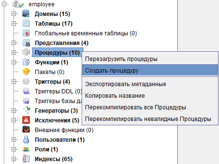
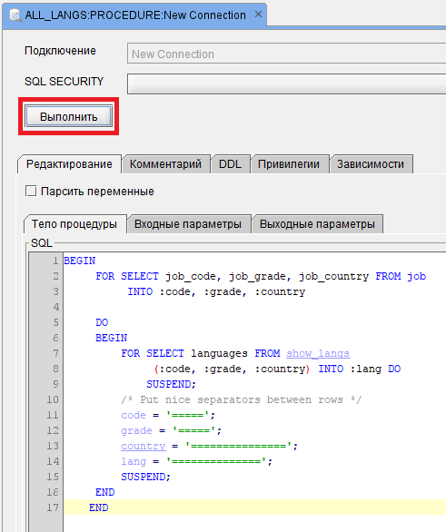
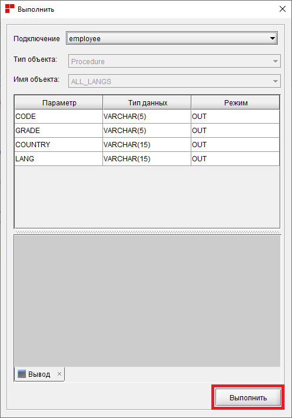
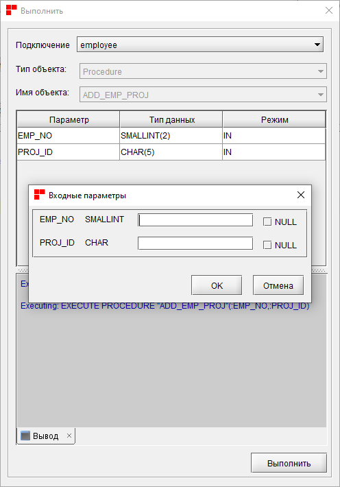

# Цель

Изучить язык разработки хранимых процедур.

# Порядок выполнения

Для выполнения работы используется БД `employee.fdb` и язык `PSQL`.

1.  Создать хранимую процедуру для добавления нового сотрудника в базу
    данных.
2.  Создать хранимую процедуру для изменения департамента сотрудника.
3.  Создать хранимую процедуру для удаления проекта из базы данных.
4.  Создать хранимую процедуру для увеличения/уменьшения зарплаты
    сотрудника на определённый процент.
5.  С помощью профайлера исследовать производительность хранимых
    процедур при выполнении сложных запросов к базе данных.

# Справочная информация

Хранимая процедура, является программой, хранящейся в области метаданных
базы данных и выполняющейся на стороне сервера. К хранимой процедуре
могут обращаться хранимые процедуры, триггеры и клиентские программы.
Допустима рекурсия --- хранимая процедура может обращаться сама к себе.

Существует два вида хранимых процедур --- выполняемые хранимые процедуры
(executed stored procedures) и хранимые процедуры выбора (selected
stored procedures).

Выполняемые хранимые процедуры осуществляют обработку данных,
находящихся в базе данных, или вовсе не связанных с базой данных. Эти
процедуры могут получать входные параметры и возвращать выходные
параметры.

Хранимые процедуры выбора как правило осуществляют выборку данных из
базы данных, возвращая произвольное количество полученных строк.
Процедуры выбора также могут получать входные параметры. Значение каждой
очередной прочитанной строки возвращается вызвавшей программе в выходных
параметрах.

Для создания хранимой процедуры с помощью RedExpert необходимо открыть
дерево объектов текущего подключения, найти группу \"Процедуры\" и в
контекстном меню выбрать пункт \"Создать процедуру\".

В открывшемся окне создать процедуру можно двумя способами: написать
самостоятельно код PSQL во вкладке DDL, либо использовать специальные
вкладки \"тело процедуры\", \"входные параметры\", \"выходные
параметры\".

Тело процедуры состоит из необязательных объявлений локальных
переменных, подпрограмм и именованных курсоров, и одного или нескольких
операторов, или блоков операторов, заключённых во внешнем блоке, который
начинается с ключевого слова BEGIN, и завершается ключевым словом END.

Для того чтобы выполнить хранимую процедуру с помощью RedExpert
необходимо:

> 1.  Двойным кликом мыши нажать на имя процедуры в группе \"Процедуры\"
>     дерева объектов текущего подключения
>
> 2.  Нажать кнопку \"Выполнить\"
>
>     
>
> 3.  В появившемся окне снова нажать кнопку \"Выполнить\"
>
>     
>
> 4.  (Опционально) Если у процедуры имеются входные параметры,
>     необходимо ввести их значения в появившемся окне и нажать кнопку
>     \"ОК\"
>
>     

Для получения дополнительной информации обратитесь к [Руководству по
SQL](https://reddatabase.ru/ru/documentation/)
