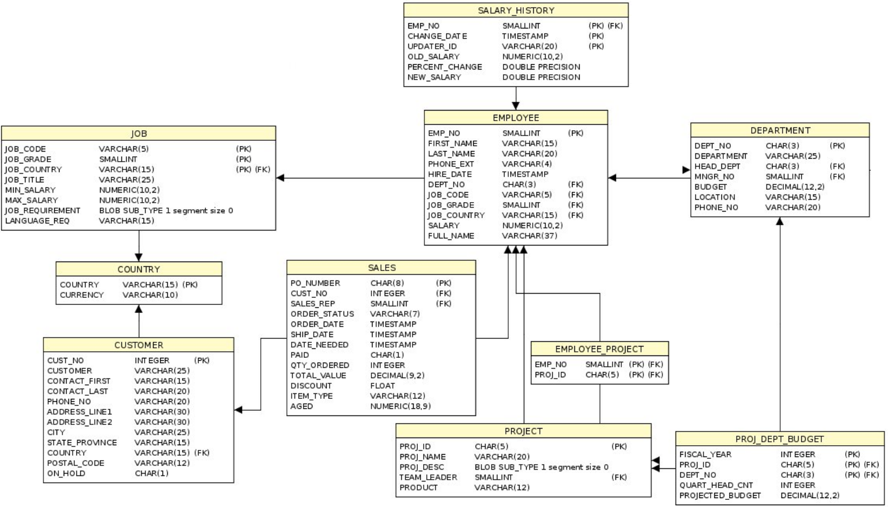

# Цель

Изучить основы языка SQL. Научится делать выборку данных, фильтрацию и
сортировку.

# Порядок выполнения

1.  Изучить схему БД `employee.fdb`.



2.  Выбрать все страны и их валюты.
3.  Отобразить всех клиентов из одного города. Город выбрать
    самостоятельно.
4.  Выбрать всех сотрудников, принятых на работу в 1991 году. Отобразить
    полное имя и дату приема на работу. Отсортировать данные по дате
    приема на работу в порядке убывания.
5.  Выбрать всех сотрудников из страны \"USA\" с зарплатой от 70000
    до 100000. Отобразить полное имя, страну и зарплату. Отсортировать
    данные в порядке убывания зарплаты.
6.  Выбрать первые 3 самых высокооплачиваемых сотрудника.
7.  Выбрать все заказы, по которым была оплата, но заказ не доставлен.
    Отобразить номер заказа, дату заказа, статус оплаты, статус заказа,
    количество дней просрочки доставки заказа (с даты заказа по текущую
    дату). Отсортировать данные в порядке уменьшения количества дней
    просрочки.
8.  Выбрать коды всех сотрудников у которых в 1993 году было снижение
    зарплаты. Отобразить код сотрудника, дату изменения зарплаты,
    предыдущую зарплату, процент изменения, новую зарплату.
    Отсортировать данные по проценту изменения в порядке убывания.

# Справочная информация

1.  Пример. Необходимо извлечь полное имя `FULL_NAME` и дату
    приема `HIRE_DATE` из таблицы сотрудников `EMPLOYEE`.

``` sql
SELECT E.FULL_NAME, E.HIRE_DATE FROM EMPLOYEE E
```

Для упрощения написания запроса для таблицы `EMPLOYEE` задан
псевдоним `E`, который используется при перечислении
выбираемых полей.

2\. Пример. Из таблицы `EMPLOYEE` необходимо выбрать всех
сотрудников из списка стран `Canada, USA` (таблица
`JOB_COUNTRY`), у которых заработная плата
`SALARY` превышает 100000.

``` sql
SELECT * FROM EMPLOYEE E WHERE UPPER(E.JOB_COUNTRY) IN ('CANADA', 'USA')  AND E.SALARY > 100000
```

В запрос добавлено условие, позволяющее отфильтровать записи с
недопустимыми значениями поля `JOB_COUNTRY`. При описании
условия использована функция `UPPER`, переводящая все
символы строкового поля к верхнему регистру для учета всех возможных
вариантов записи названия стран.
